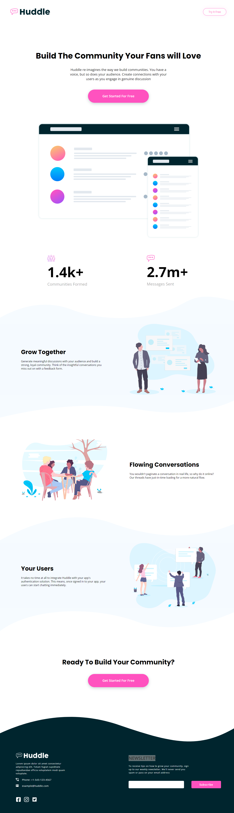

<h1 align="center">Frontend Mentor - Huddle landing page with curved sections solution</h1>

This is a solution to the [Huddle landing page with curved sections challenge on Frontend Mentor](https://www.frontendmentor.io/challenges/huddle-landing-page-with-curved-sections-5ca5ecd01e82137ec91a50f2). Frontend Mentor challenges help you improve your coding skills by building realistic projects. 

## Table of contents

- [Overview](#overview)
  - [The challenge](#the-challenge)
  - [Screenshot](#screenshot)
  - [Links](#links)
- [My process](#my-process)
  - [Built with](#built-with)
  - [What I learned](#what-i-learned)
- [Author](#author)

## Overview

### The challenge

Users should be able to:

- View the optimal layout for the site depending on their device's screen size
- See hover states for all interactive elements on the page

### Screenshot

### Links

- Solution URL: [Landing page with curved sections](https://www.frontendmentor.io/solutions/landing-page-with-curved-sections-1Ov6QWdL6)
- Live Site URL: [Huddle Landing Page](https://huddle-landing-312.netlify.app/)

## My process

### Built with

- Semantic HTML5 markup
- Flexbox
- Responsive Design
- [React](https://reactjs.org/) - JS library
- [Sass](https://sass-lang.com/) - CSS Preprocessor

### What I learned

I learnt using shapes in layout for making sections of the webpage more interesting. It was great to practice the CSS skills for responsive designs and being able to transform images to responsive web pages.

## Author

- Website - [Asidipta Chaudhuri](https://portfolio-asi309.vercel.app/)
- Frontend Mentor - [@asi309](https://www.frontendmentor.io/profile/asi309)
